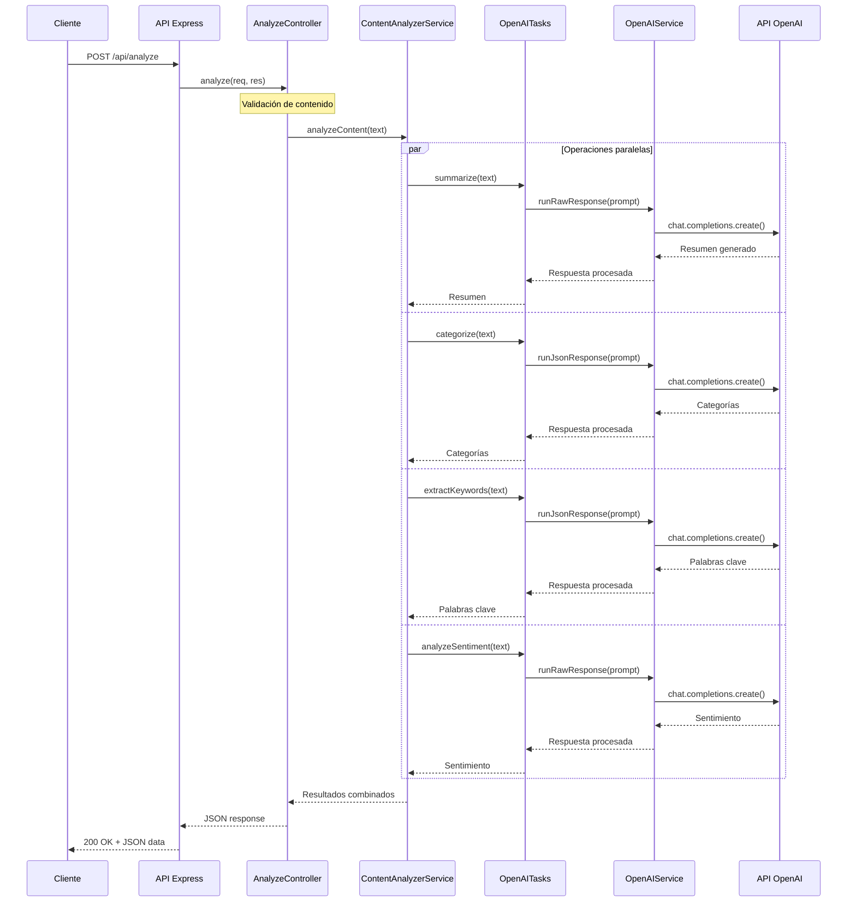
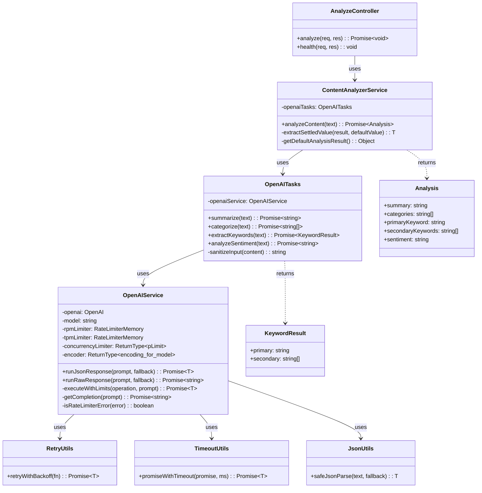
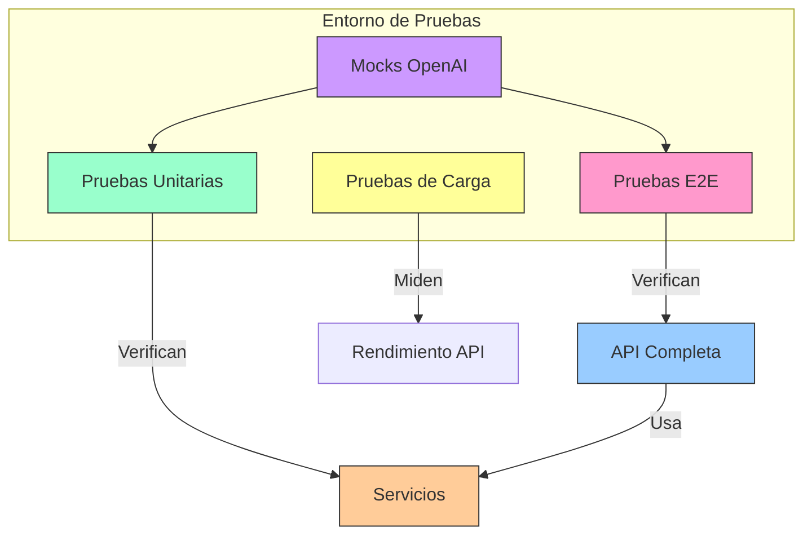
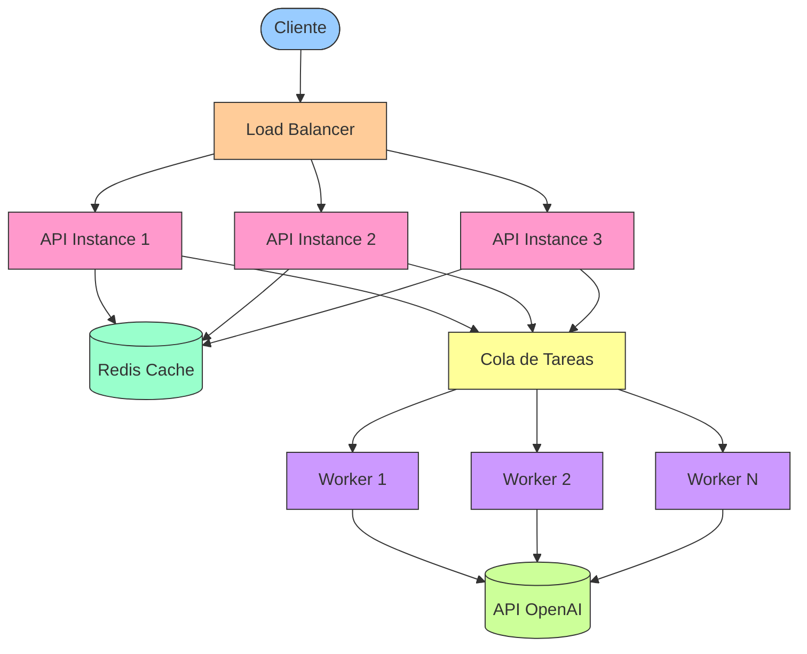

# GrowthX API de Análisis de Textos con LLMs

Esta API utiliza modelos de lenguaje (LLMs) para analizar textos, realizando cuatro operaciones clave: resumen, categorización, extracción de palabras clave y análisis de sentimiento.

## Tabla de Contenidos
- [Enfoque y Decisiones de Diseño](#enfoque-y-decisiones-de-diseño)
- [Características](#características)
- [Requisitos](#requisitos)
- [Instalación y Configuración](#instalación-y-configuración)
- [Arquitectura](#arquitectura)
- [Gestión de la No Determinación en LLMs](#gestión-de-la-no-determinación-en-llms)
- [Pruebas y Rendimiento](#pruebas-y-rendimiento)
- [Consideraciones de Escalabilidad](#consideraciones-de-escalabilidad)

## Enfoque y Decisiones de Diseño

Al abordar este desafío técnico, implementé una arquitectura que optimiza la fiabilidad, mantenibilidad y escalabilidad:

### Separación de responsabilidades

Descompuse el problema en componentes modulares siguiendo el principio de responsabilidad única:

- **Controladores**: Gestión de peticiones HTTP y respuestas
- **Servicios**: Encapsulación de la lógica de negocio
- **Tareas específicas de LLM**: Prompts especializados para cada operación de análisis
- **Servicio OpenAI**: Abstraje las interacciones con la API de OpenAI con gestión de límites

Esta separación permite el mantenimiento independiente de cada componente y facilita la evolución del sistema.

### Optimización de rendimiento

Identifiqué que las llamadas a LLM constituyen el principal cuello de botella, por lo que implementé:

- **Procesamiento paralelo**: Las cuatro operaciones de análisis se ejecutan concurrentemente mediante `Promise.allSettled`.
- **Sistema de rate limiting en tres capas**: Control de concurrencia, solicitudes por minuto (RPM) y tokens por minuto (TPM).
- **Backoff exponencial**: Implementé reintentos inteligentes para gestionar errores transitorios.

### Garantía de resultados consistentes

Para asegurar que las respuestas cumplan con los requisitos específicos del proyecto:

- **Categorización**: Limité el resultado a un máximo de 5 categorías mediante validación explícita
- **Palabra clave primaria**: Garanticé que sea una cadena mediante tipado estricto y validación
- **Palabras clave secundarias**: Implementé validación para asegurar un array de strings
- **Análisis de sentimiento**: Normalicé las respuestas a exclusivamente "positive", "negative" o "neutral"

## Características

- **Resumen de contenido**: Genera resúmenes concisos de textos largos
- **Categorización**: Identifica hasta cinco categorías principales del contenido
- **Extracción de palabras clave**: Determina una palabra clave principal y palabras clave secundarias
- **Análisis de sentimiento**: Clasifica el tono general como positivo, negativo o neutral
- **API RESTful**: Interfaz simple para integración con otras aplicaciones
- **Documentación Swagger**: API documentada con interfaz interactiva
- **Manejo de límites de tasa (Rate Limiting)**: Control eficiente de solicitudes a la API de OpenAI
- **Pruebas end-to-end y de carga**: Validación de funcionamiento y rendimiento

## Requisitos

- Node.js v22+
- NPM v10+
- Clave de API de OpenAI

## Instalación y Configuración

1. **Clonar el repositorio**:
   ```bash
   git clone https://github.com/tu-usuario/growthx-app.git
   cd growthx-app
   ```

2. **Instalar dependencias**:
   ```bash
   npm install
   ```

3. **Configurar variables de entorno** (`.env.local`):
   ```
   # Obligatorio
   OPENAI_API_KEY=tu-clave-api-openai

   # Opcional - Configuración del servidor
   PORT=3000
   NODE_ENV=development

   # Opcional - Configuración de OpenAI
   OPENAI_MODEL=o3-mini
   REQUEST_TIMEOUT=30000

   # Opcional - Rate Limiting
   MAX_CONCURRENCY=8
   MAX_RPM=100
   MAX_TPM=10000
   ```

4. **Iniciar el servidor**:
   ```bash
   # Desarrollo
   npm run dev
   
   # Producción
   npm run build
   npm start
   ```

La API estará disponible en `http://localhost:3000` y la documentación Swagger en `http://localhost:3000/api-docs`.

## Uso de la API

### Endpoint de Análisis

```http
POST /api/analyze
Content-Type: application/json

{
  "title": "Machine Learning Fundamentals",
  "content": "El texto completo para analizar..."
}
```

**Respuesta**:
```json
{
  "status": "success",
  "data": {
    "summary": "Resumen conciso del contenido...",
    "categories": ["educación", "tecnología", "inteligencia artificial"],
    "primaryKeyword": "aprendizaje automático",
    "secondaryKeywords": ["algoritmos", "redes neuronales", "datos"],
    "sentiment": "positive"
  }
}
```

### Endpoint de Estado

```http
GET /api/health
```

**Respuesta**:
```json
{
  "status": "ok",
  "model": "o3-mini",
  "timestamp": "2023-05-08T22:24:42Z"
}
```

## Arquitectura

La aplicación sigue una arquitectura en capas que optimiza la separación de responsabilidades y facilita las modificaciones:


### Flujo de Operaciones

El siguiente diagrama ilustra el flujo de procesamiento para una solicitud de análisis:



### Diagrama de Componentes

Este diagrama muestra la organización de los principales componentes y sus relaciones:



### Componentes principales:

1. **Express.js**: Framework web para la gestión de rutas y middlewares
2. **Controllers**: Manejan las solicitudes HTTP y delegan el procesamiento a los servicios
3. **Services**: Contienen la lógica de negocio y orquestan operaciones complejas
   - **ContentAnalyzerService**: Coordina las operaciones de análisis de texto
   - **OpenAIService**: Encapsula la interacción con la API de OpenAI
4. **Types**: Definiciones de tipos TypeScript para garantizar la seguridad de tipos
5. **Utils**: Utilidades como gestión de reintentos, timeouts y transformación de datos

Esta arquitectura permite un acoplamiento bajo entre componentes y facilita la sustitución de implementaciones (por ejemplo, cambiar de OpenAI a otro proveedor de LLM).

## Gestión de la Naturaleza No Determinista de los LLMs

Los modelos de lenguaje grande (LLMs) son inherentemente no deterministas, lo que presenta desafíos únicos para crear APIs confiables. He implementado varias estrategias para mitigar esta imprevisibilidad:

### 1. Técnicas de prompting avanzadas

Utilizo "Prompt Decorators", una nueva técnica ([Ver](https://synaptiai.github.io/prompt-decorators/),
[Medium](https://medium.com/agileinsider/reasoning-depth-comprehensive-a-first-principles-approach-to-enhanced-llm-interactions-7052cbb3e2ea))
que parece mejora significativamente la consistencia de las respuestas (es necesario hacer más pruebas determinar su
efectividad, pero hasta el momento parece acogida). A continuación se muestran ejemplos reales de los
prompts utilizados en cada tarea de análisis:

```typescript
// Ejemplo: Análisis de sentimiento con decoradores
const sentimentPrompt = `
  +++OutputFormat(format=single-word, allowed=["positive", "negative", "neutral"])
  +++Constraint(type=response-length, max=1)
  +++ErrorHandling(strategy=graceful-fallback, default="neutral")
  +++SecurityBoundary(enforce=strict)
  Classify the sentiment of this text as positive, negative, or neutral.
  Respond with a single word only, no explanations.

  TEXT TO ANALYZE:
  ${sanitizedContent}
`;
```

Cada decorador resuelve un problema específico:

- **+++OutputFormat**: Define explícitamente el formato de respuesta esperado
- **+++Constraint**: Establece límites precisos para la respuesta
- **+++ErrorHandling**: Define comportamiento para casos excepcionales
- **+++SecurityBoundary**: Mejora la resistencia contra ataques de inyección

### 2. Validación y Normalización Post-Procesamiento

Implementé validación rigurosa para garantizar que las respuestas cumplan con los requisitos especificados:

```typescript
// Normalización de sentimiento
const normalizedSentiment = sentiment.trim().toLowerCase();
if (!['negative', 'neutral', 'positive'].includes(normalizedSentiment)) {
  console.warn(`Sentimiento no válido recibido: "${normalizedSentiment}", usando "neutral"`);
  return 'neutral';
}
```

### 3. Protección contra Inyección de Prompt

Implementé técnicas de sanitización para neutralizar posibles ataques de inyección:

```typescript
private sanitizeInput(content: string): string {
  // Eliminar decoradores que podrían intentar inyectarse
  let sanitized = content.replace(/\+\+\+\w+(\(.*?\))?/g, '[FILTERED]');

  // Filtrar patrones comunes de ataques
  const injectionPatterns = [
    /ignore (previous|above|all) instructions/gi,
    /disregard (previous|above|all) instructions/gi,
    /forget (previous|above|all) instructions/gi,
    /new instructions/gi,
    /instead (do|perform|follow)/gi,
  ];

  for (const pattern of injectionPatterns) {
    sanitized = sanitized.replace(pattern, '[FILTERED]');
  }

  return sanitized;
}
```

### 4. Manejo de Errores

Diseñé un sistema que proporciona respuestas significativas incluso cuando ocurren fallos:

```typescript
// En ContentAnalyzerService
const tasks = {
  categories: this.openaiTasks.categorize(content).catch(() => ['uncategorized']),
  keywords: this.openaiTasks.extractKeywords(content).catch(() => ({ primary: '', secondary: [] })),
  sentiment: this.openaiTasks.analyzeSentiment(content).catch(() => 'neutral'),
  summary: this.openaiTasks.summarize(content).catch(() => ''),
};

// Usando Promise.allSettled para garantizar respuestas incluso con fallos parciales
const results = await Promise.allSettled([tasks.categories, tasks.summary, tasks.keywords, tasks.sentiment]);
```

Esta combinación de técnicas convierte la naturaleza impredecible de los LLMs en un sistema confiable y consistente para análisis de texto.

## Pruebas y Rendimiento

### Pruebas End-to-End

Implementé pruebas automatizadas que verifican el funcionamiento completo de la API:

```bash
npm run test:run
```

### Diagrama de arquitectura de pruebas



### Pruebas de Carga y Límites de OpenAI

Un aspecto crítico del sistema es su comportamiento bajo carga. Implementé pruebas específicas con autocannon para medir el rendimiento:

```bash
npm run load-test:light    # 5 conexiones concurrentes
npm run load-test:medium   # 25 conexiones concurrentes
npm run load-test:heavy    # 50 conexiones concurrentes
```

Ejemplo de resultados de prueba de carga:

| Métrica                   | Valor |
| ------------------------- | ----- |
| Solicitudes/seg promedio  | 1059  |
| Latencia promedio (ms)    | 4.19  |
| Latencia máxima (ms)      | 796   |
| Solicitudes totales       | 10590 |
| Respuestas exitosas (2xx) | 10590 |
| Respuestas con error      | 0     |

La API mantuvo un 100% de respuestas exitosas gracias al sistema de manejo de errores y reintentos implementado. Internamente , el sistema de rate limiting y la gestión de concurrencia aseguraron que las solicitudes no excedieran los límites impuestos por OpenAI.

#### Límites de Concurrencia en OpenAI

Hice una breve investigación durante el desarrollo y encontré un límite crítico de concurrencia en la API de OpenAI:

- Los planes premium están limitados a aproximadamente **8 solicitudes concurrentes**
- Solicitudes que exceden este límite experimentan un incremento significativo en latencia
- Este límite es especialmente restrictivo para operaciones que pueden tardar 10-40 segundos

Para abordar esta restricción, implementé:

1. **Control de concurrencia**: Limitación a 8 solicitudes paralelas con `p-limit`
2. **Rate limiting multi-nivel**: Implementación de límites tanto en RPM como en TPM
3. **Estrategia de backoff exponencial**: Reintentos inteligentes cuando se detectan límites

## Consideraciones de Escalabilidad

La arquitectura fue diseñada con escalabilidad en mente. A continuación, presento algunas estrategias clave para escalar el sistema a casos de uso empresariales:

### 1. Procesamiento de Documentos Extensos

Se puede dividir el contenido extenso en fragmentos más pequeños para su análisis. Esto es especialmente útil para documentos largos que superan los límites de tokens de OpenAI.

```typescript
function splitIntoChunks(text: string, chunkSize: number = 4000): string[] {
  const paragraphs = text.split('\n\n');
  const chunks: string[] = [];
  let currentChunk = '';

  for (const paragraph of paragraphs) {
    if (currentChunk.length + paragraph.length > chunkSize) {
      chunks.push(currentChunk.trim());
      currentChunk = '';
    }
    currentChunk += paragraph + '\n\n';
  }

  if (currentChunk.trim()) {
    chunks.push(currentChunk.trim());
  }

  return chunks;
}
```

Esta técnica divide el texto en fragmentos más pequeños respetando los límites naturales de párrafos, lo que preserva el contexto local. Luego aplicamos estrategias específicas para cada tipo de análisis:

#### Aplicación a las tareas de análisis

**1. Resumen de textos extensos:**
```typescript
async summarizeLargeContent(content: string): Promise<string> {
  if (content.length < 4000) {
    return this.openaiTasks.summarize(content);
  }
  
  // 1. Dividir en fragmentos
  const chunks = splitIntoChunks(content, 3800);
  
  // 2. Resumir cada fragmento paralelamente
  const chunkSummaries = await Promise.all(
    chunks.map(chunk => this.openaiTasks.summarize(chunk))
  );
  
  // 3. Si los resúmenes combinados siguen siendo extensos, generar un meta-resumen
  const combinedSummary = chunkSummaries.join('\n\n');
  
  if (combinedSummary.length > 4000) {
    return this.openaiTasks.summarize(combinedSummary);
  }
  
  return combinedSummary;
}
```

**2. Categorización de contenido extenso:**
```typescript
async categorizeLargeContent(content: string): Promise<string[]> {
  if (content.length < 4000) {
    return this.openaiTasks.categorize(content);
  }
  
  // 1. Dividir en fragmentos
  const chunks = splitIntoChunks(content, 3800);
  
  // 2. Categorizar cada fragmento
  const allCategories: string[][] = await Promise.all(
    chunks.map(chunk => this.openaiTasks.categorize(chunk))
  );
  
  // 3. Contar frecuencia de cada categoría
  const categoryFrequency = new Map<string, number>();
  
  allCategories.flat().forEach(category => {
    const normalizedCategory = category.toLowerCase();
    categoryFrequency.set(
      normalizedCategory, 
      (categoryFrequency.get(normalizedCategory) || 0) + 1
    );
  });
  
  // 4. Seleccionar las 5 categorías más frecuentes
  return Array.from(categoryFrequency.entries())
    .sort((a, b) => b[1] - a[1])
    .slice(0, 5)
    .map(([category]) => category);
}
```

**3. Extracción de palabras clave:**
```typescript
async extractKeywordsFromLargeContent(content: string): Promise<{primary: string, secondary: string[]}> {
  if (content.length < 4000) {
    return this.openaiTasks.extractKeywords(content);
  }
  
  // 1. Dividir en fragmentos
  const chunks = splitIntoChunks(content, 3800);
  
  // 2. Extraer palabras clave de cada fragmento
  const allKeywords = await Promise.all(
    chunks.map(chunk => this.openaiTasks.extractKeywords(chunk))
  );
  
  // 3. Contar frecuencia de palabras clave
  const keywordFrequency = new Map<string, number>();
  
  // Añadir palabras clave primarias con peso 3
  allKeywords.forEach(result => {
    const normalizedKeyword = result.primary.toLowerCase();
    keywordFrequency.set(
      normalizedKeyword,
      (keywordFrequency.get(normalizedKeyword) || 0) + 3
    );
  });
  
  // Añadir palabras clave secundarias con peso 1
  allKeywords.forEach(result => {
    result.secondary.forEach(keyword => {
      const normalizedKeyword = keyword.toLowerCase();
      keywordFrequency.set(
        normalizedKeyword,
        (keywordFrequency.get(normalizedKeyword) || 0) + 1
      );
    });
  });
  
  // 4. Determinar la palabra clave primaria y las secundarias
  const sortedKeywords = Array.from(keywordFrequency.entries())
    .sort((a, b) => b[1] - a[1]);
  
  return {
    primary: sortedKeywords[0][0],
    secondary: sortedKeywords.slice(1, 11).map(([keyword]) => keyword)
  };
}
```

**4. Análisis de sentimiento:**
```typescript
async analyzeSentimentOfLargeContent(content: string): Promise<string> {
  if (content.length < 4000) {
    return this.openaiTasks.analyzeSentiment(content);
  }
  
  // 1. Dividir en fragmentos
  const chunks = splitIntoChunks(content, 3800);
  
  // 2. Analizar sentimiento de cada fragmento
  const sentiments = await Promise.all(
    chunks.map(chunk => this.openaiTasks.analyzeSentiment(chunk))
  );
  
  // 3. Contar frecuencia de cada sentimiento
  const sentimentCounts = {
    'positive': 0,
    'negative': 0,
    'neutral': 0
  };
  
  sentiments.forEach(sentiment => {
    sentimentCounts[sentiment]++;
  });
  
  // 4. Determinar el sentimiento predominante
  if (sentimentCounts.positive > sentimentCounts.negative) {
    return sentimentCounts.positive > sentimentCounts.neutral ? 'positive' : 'neutral';
  } else if (sentimentCounts.negative > sentimentCounts.positive) {
    return sentimentCounts.negative > sentimentCounts.neutral ? 'negative' : 'neutral';
  } else {
    return 'neutral';
  }
}
```

#### Ventajas del procesamiento por lotes

Este enfoque brinda varias ventajas importantes:

1. **Escalabilidad**: Permite procesar documentos de cualquier tamaño, superando la limitación de contexto de los LLMs.
2. **Preservación del contexto**: Al respetar límites de párrafos, mantenemos la coherencia dentro de cada fragmento.
3. **Procesamiento paralelo**: Las tareas se ejecutan concurrentemente, reduciendo el tiempo total de procesamiento.
4. **Agregación inteligente**: Cada tipo de análisis utiliza un método de combinación adecuado a su naturaleza (meta-resumen para resúmenes, frecuencia para categorías, etc.).
5. **Eficiencia de costos**: Optimiza el uso de tokens al enviar solo el contenido necesario para cada tarea.

#### Implementación en producción

En un entorno de producción, estas técnicas se integrarían con sistemas asíncronos de procesamiento y notificación para manejar tiempos de respuesta prolongados en documentos muy extensos. Por ejemplo:

```typescript
// Pseudocódigo
async function handleLargeDocumentAnalysis(content: string): Promise<string> {
  // Si el contenido es grande, procesarlo en segundo plano
  if (content.length > 10000) {
    const jobId = await queueService.enqueueJob({
      type: 'document-analysis',
      content,
      timestamp: new Date()
    });
    
    return jobId; // Devolver un ID que el cliente puede usar para consultar el estado
  }
  
  // Procesar documentos pequeños inmediatamente
  return await contentAnalyzerService.analyzeContent(content);
}
```

Esta arquitectura permite que la API siga siendo responsiva incluso cuando procesa documentos muy grandes.

### Arquitectura de escalabilidad futura



Este diseño permitiría:

- **Escalado horizontal**: Aumento de capacidad mediante instancias adicionales
- **Procesamiento asíncrono**: Manejo de tareas largas mediante colas de trabajo
- **Optimización de costos**: Reducción de llamadas a OpenAI mediante caché
- **Resistencia a fallos**: Continuidad de servicio incluso ante fallos de componentes individuales

---

## Implementaciones Futuras

1. **Sistema de caché inteligente**: Almacenamiento de análisis frecuentes para reducir latencia y costos
2. **Soporte para múltiples formatos**: Preprocesamiento para PDF, Markdown y HTML
3. **Panel de observabilidad**: Métricas detalladas de rendimiento y uso
4. **Adaptadores para modelos alternativos**: Compatibilidad con Claude, Llama 2 y otros LLMs
5. **API de embeddings**: Búsqueda semántica y clustering de documentos similares