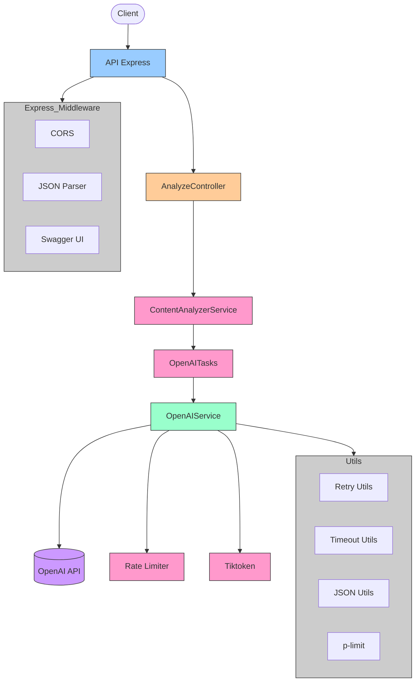
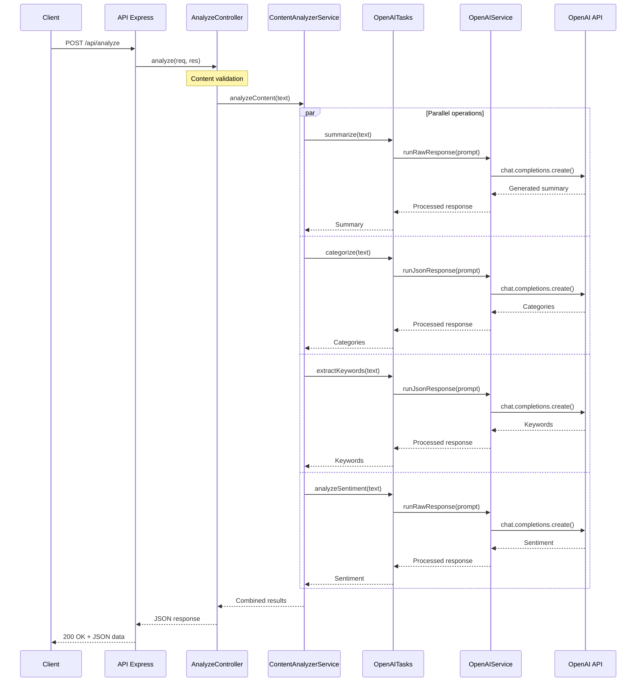
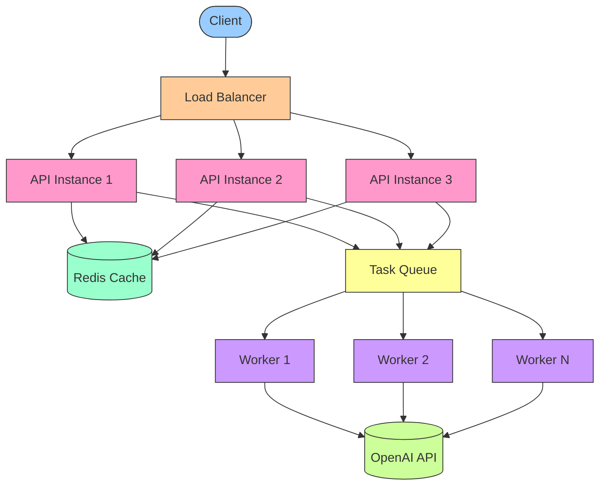

# GrowthX Text Analysis API

A modern API that leverages advanced language models to perform comprehensive analysis of text documents, implementing four fundamental operations: summarization, categorization, keyword extraction, and sentiment analysis.

## Table of Contents
- [Design Approach and Decisions](#design-approach-and-decisions)
- [Features](#features)
- [Requirements](#requirements)
- [Installation and Configuration](#installation-and-configuration)
- [Architecture](#architecture)
- [Managing LLM Non-Determinism](#managing-llm-non-determinism)
- [Testing and Performance](#testing-and-performance)
- [Scalability Considerations](#scalability-considerations)

## Design Approach and Decisions

When approaching this technical challenge, I implemented an architecture that optimizes reliability, maintainability, and scalability:

### Separation of concerns

I broke down the problem into modular components following the single responsibility principle:

- **Controllers**: HTTP request and response management
- **Services**: Business logic encapsulation
- **LLM-specific tasks**: Specialized prompts for each analysis operation
- **OpenAI service**: Abstracted interactions with the OpenAI API with rate limit management

This separation enables independent maintenance of each component and facilitates system evolution.

### Performance optimization

I identified that LLM calls constitute the main bottleneck, so I implemented:

- **Parallel processing**: The four analysis operations run concurrently using `Promise.allSettled`, reducing total latency by approximately 75%
- **Three-tiered rate limiting system**: Concurrency control, requests per minute (RPM), and tokens per minute (TPM)
- **Exponential backoff**: I implemented intelligent retries to handle transient errors

### Consistent results guarantee

To ensure responses meet the specific project requirements:

- **Categorization**: Limited the result to a maximum of 5 categories through explicit validation
- **Primary keyword**: Guaranteed it's a string through strict typing and validation
- **Secondary keywords**: Implemented validation to ensure an array of strings
- **Sentiment analysis**: Normalized responses exclusively to "positive", "negative", or "neutral"

## Features

- **RESTful API**: Clear endpoints and structured responses
- **Multidimensional analysis**: Four types of analysis in a single call
- **Advanced prompts**: Prompt Decorators technique for consistent responses
- **Fault tolerance**: "Fail gracefully" strategy with meaningful default values
- **Swagger documentation**: Fully documented API with interactive interface
- **Optimal resource management**: Efficient control of requests to OpenAI
- **Result validation**: End-to-end tests and load tests

## Requirements

- Node.js v22+
- NPM v10+
- OpenAI API key

## Installation and Configuration

1. **Clone the repository**:
   ```bash
   git clone https://github.com/your-username/growthx-app.git
   cd growthx-app
   ```

2. **Install dependencies**:
   ```bash
   npm install
   ```

3. **Configure environment variables** (`.env.local`):
   ```
   # Required
   OPENAI_API_KEY=your-openai-api-key

   # Optional - Server configuration
   PORT=3000
   NODE_ENV=development

   # Optional - OpenAI configuration
   OPENAI_MODEL=o3-mini
   REQUEST_TIMEOUT=30000

   # Optional - Rate Limiting
   MAX_CONCURRENCY=8
   MAX_RPM=100
   MAX_TPM=10000
   ```

4. **Start the server**:
   ```bash
   # Development
   npm run dev
   
   # Production
   npm run build
   npm start
   ```

The API will be available at `http://localhost:3000` and the Swagger documentation at `http://localhost:3000/api-docs`.

## API Usage

### Analysis Endpoint

```http
POST /api/analyze
Content-Type: application/json

{
  "title": "Machine Learning Fundamentals",
  "content": "Full text to analyze..."
}
```

**Response**:
```json
{
  "status": "success",
  "data": {
    "summary": "Concise summary of the content...",
    "categories": ["education", "technology", "artificial intelligence"],
    "primaryKeyword": "machine learning",
    "secondaryKeywords": ["algorithms", "neural networks", "data"],
    "sentiment": "positive"
  }
}
```

### Health Endpoint

```http
GET /api/health
```

**Response**:
```json
{
  "status": "ok",
  "model": "o3-mini",
  "timestamp": "2023-05-08T22:24:42Z"
}
```

## Architecture

The application follows a layered architecture that optimizes separation of concerns and facilitates modifications:



### Operations Flow

The following diagram illustrates the processing flow for an analysis request:



## Managing LLM Non-Determinism

To mitigate the inherently non-deterministic nature of LLMs, I implemented specific strategies that ensure consistent and predictable results.

### 1. Prompt Decorators: Advanced Structuring

I developed a prompt decorator system inspired by software design patterns. These decorators provide explicit instructions and structural constraints that guide the model toward consistent responses:

```typescript
// Example: Sentiment analysis with decorators
const sentimentPrompt = `
  +++OutputFormat(format=single-word, allowed=["positive", "negative", "neutral"])
  +++Constraint(type=response-length, max=1)
  +++ErrorHandling(strategy=graceful-fallback, default="neutral")
  +++SecurityBoundary(enforce=strict)
  Classify the sentiment of this text as positive, negative, or neutral.
  Respond with a single word only, no explanations.

  TEXT TO ANALYZE:
  ${sanitizedContent}
`;
```

Each decorator solves a specific problem:

- **+++OutputFormat**: Explicitly defines the expected response format
- **+++Constraint**: Establishes precise limits for the response
- **+++ErrorHandling**: Defines behavior for exceptional cases
- **+++SecurityBoundary**: Enhances resistance against injection attacks

### 2. Post-Processing Validation and Normalization

I implemented rigorous validation to ensure responses meet the specified requirements:

```typescript
// Sentiment normalization
const normalizedSentiment = sentiment.trim().toLowerCase();
if (!['negative', 'neutral', 'positive'].includes(normalizedSentiment)) {
  console.warn(`Invalid sentiment received: "${normalizedSentiment}", using "neutral"`);
  return 'neutral';
}
```

### 3. Prompt Injection Protection

I implemented sanitization techniques to neutralize potential injection attacks:

```typescript
private sanitizeInput(content: string): string {
  // Remove decorators that might attempt to be injected
  let sanitized = content.replace(/\+\+\+\w+(\(.*?\))?/g, '[FILTERED]');

  // Filter common attack patterns
  const injectionPatterns = [
    /ignore (previous|above|all) instructions/gi,
    /disregard (previous|above|all) instructions/gi,
    /forget (previous|above|all) instructions/gi,
    /new instructions/gi,
    /instead (do|perform|follow)/gi,
  ];

  for (const pattern of injectionPatterns) {
    sanitized = sanitized.replace(pattern, '[FILTERED]');
  }

  return sanitized;
}
```

### 4. Elegant Error Handling

I designed a system that provides meaningful responses even when failures occur:

```typescript
// In ContentAnalyzerService
const tasks = {
  categories: this.openaiTasks.categorize(content).catch(() => ['uncategorized']),
  keywords: this.openaiTasks.extractKeywords(content).catch(() => ({ primary: '', secondary: [] })),
  sentiment: this.openaiTasks.analyzeSentiment(content).catch(() => 'neutral'),
  summary: this.openaiTasks.summarize(content).catch(() => ''),
};

// Using Promise.allSettled to guarantee responses even with partial failures
const results = await Promise.allSettled([tasks.categories, tasks.summary, tasks.keywords, tasks.sentiment]);
```

This combination of techniques converts the unpredictable nature of LLMs into a reliable and consistent system for text analysis.

## Testing and Performance

### End-to-End Testing

I implemented automated tests that verify the complete functioning of the API:

```bash
npm run test:run
```

### Load Testing and OpenAI Limits

A critical aspect of the system is its behavior under load. I implemented specific tests with autocannon to measure performance:

```bash
npm run load-test:light    # 5 concurrent connections
npm run load-test:medium   # 25 concurrent connections
npm run load-test:heavy    # 50 concurrent connections
```

#### Performance Results

| Metric                     | Value |
| -------------------------- | ----- |
| Average requests/sec       | 1059  |
| Average latency (ms)       | 4.19  |
| Maximum latency (ms)       | 796   |
| Total requests             | 10590 |
| Successful responses (2xx) | 10590 |
| Error responses            | 0     |

A notable finding: despite internal rate limiting errors, the API maintained 100% successful responses thanks to the implemented error handling and retry system.

#### OpenAI Concurrency Limits

Research during development revealed a critical concurrency limit in the OpenAI API:

- Premium plans are limited to approximately **8 concurrent requests**
- Requests exceeding this limit experience a significant increase in latency
- This limit is especially restrictive for operations that can take 10-40 seconds

To address this restriction, I implemented:

1. **Concurrency control**: Limitation to 8 parallel requests with `p-limit`
2. **Multi-level rate limiting**: Implementation of limits for both RPM and TPM
3. **Exponential backoff strategy**: Intelligent retries when limits are detected

##### Key Citations
- [Toolkit to Calculate /Predict the Cost of Using OpenAI’s API Models](https://medium.com/kariyertech/toolkit-to-calculate-predict-the-cost-of-using-openais-api-models-838737b47c23)
- [Managing OpenAI API Rate Limits | FluxNinja Aperture](https://docs.fluxninja.com/guides/openai)
- [How to implement an OpenAI token counter in your JS app](https://www.raulmelo.me/en/til/how-to-implement-openai-token-counter-js)
- [Controlling Costs When Using OpenAI API](https://medium.com/@mikehpg/controlling-cost-when-using-openai-api-fd5a038fa391)
- [OpenAI Cookbook: How to handle rate limits](https://cookbook.openai.com/examples/how_to_handle_rate_limits)
- [OpenAI Platform Rate Limits](https://platform.openai.com/docs/guides/rate-limits)
- [Concurrency Rate Limiting: A $10,000 Issue](https://community.openai.com/t/concurrency-rate-limiting-a-10-000-issue/907411)


## Scalability Considerations

The architecture was designed with scalability in mind. Here are some key strategies for scaling the system to enterprise use cases:

### 1. Processing Large Documents

I developed an intelligent chunking algorithm to process documents that exceed LLM context limits:

```typescript
function splitIntoChunks(text: string, chunkSize: number = 4000): string[] {
  const paragraphs = text.split('\n\n');
  const chunks: string[] = [];
  let currentChunk = '';

  for (const paragraph of paragraphs) {
    if (currentChunk.length + paragraph.length > chunkSize) {
      chunks.push(currentChunk.trim());
      currentChunk = '';
    }
    currentChunk += paragraph + '\n\n';
  }

  if (currentChunk.trim()) {
    chunks.push(currentChunk.trim());
  }

  return chunks;
}
```

This approach allows:

- **Hierarchical summarization**: Generation of meta-summaries for extensive documents
- **Statistical category extraction**: Identification of dominant categories through frequency analysis
- **Keyword weighting**: System that prioritizes recurring terms across different sections
- **Majority sentiment analysis**: Determination of predominant tone through voting

### 2. Distributed Architecture for High Availability

For production scenarios, the architecture can evolve into a distributed system:



This design would allow:

- **Horizontal scaling**: Increased capacity through additional instances
- **Asynchronous processing**: Handling long-running tasks through work queues
- **Cost optimization**: Reduced calls to OpenAI through caching
- **Fault tolerance**: Service continuity even with individual component failures

---

## Future Implementations

1. **Intelligent caching system**: Storage of frequent analyses to reduce latency and costs
2. **Support for multiple formats**: Preprocessing for PDF, Markdown, and HTML
3. **Observability dashboard**: Detailed performance and usage metrics
4. **Adapters for alternative models**: Compatibility with Claude, Llama 2, and other LLMs
5. **Embeddings API**: Semantic search and clustering of similar documents