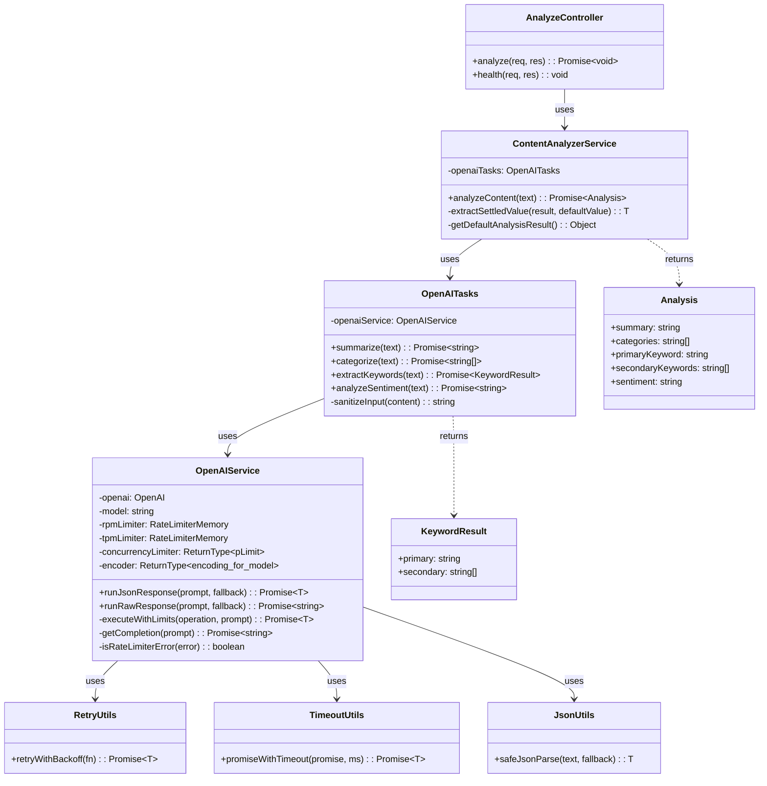
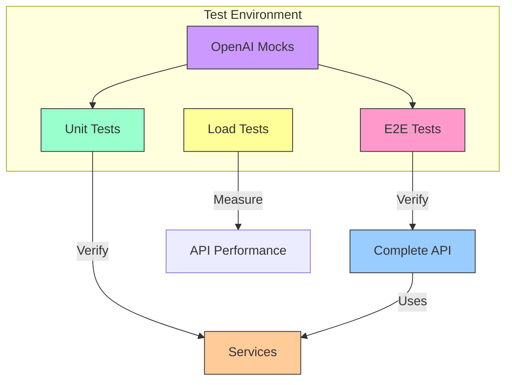

# GrowthX Text Analysis API with LLMs

This API uses large language models (LLMs) to analyze texts, performing four key operations: summarization, categorization, keyword extraction, and sentiment analysis.

## Table of Contents
- [Approach and Design Decisions](#approach-and-design-decisions)
- [Features](#features)
- [Requirements](#requirements)
- [Installation and Configuration](#installation-and-configuration)
- [Architecture](#architecture)
- [Managing Non-Determinism in LLMs](#managing-non-determinism-in-llms)
- [Testing and Performance](#testing-and-performance)
- [Scalability Considerations](#scalability-considerations)

## Approach and Design Decisions

In addressing this technical challenge, I implemented an architecture that optimizes reliability, maintainability, and scalability:

### Separation of responsibilities

I broke down the problem into modular components following the single responsibility principle:

- **Controllers**: HTTP request and response management
- **Services**: Encapsulation of business logic
- **LLM-specific tasks**: Specialized prompts for each analysis operation
- **OpenAI Service**: Abstracted interactions with the OpenAI API with rate limiting management

This separation allows independent maintenance of each component and facilitates system evolution.

### Performance optimization

I identified that LLM calls constitute the main bottleneck, so I implemented:

- **Parallel processing**: The four analysis operations are executed concurrently using `Promise.allSettled`.
- **Three-layer rate limiting system**: Concurrency control, requests per minute (RPM), and tokens per minute (TPM).
- **Exponential backoff**: I implemented smart retries to handle transient errors.

### Ensuring consistent results

To ensure that responses meet the specific requirements of the project:

- **Categorization**: Limited the result to a maximum of 5 categories through explicit validation
- **Primary keyword**: Ensured it is a string through strict typing and validation
- **Secondary keywords**: Implemented validation to ensure an array of strings
- **Sentiment analysis**: Normalized responses to exclusively "positive", "negative", or "neutral"

## Features

- **Content summarization**: Generates concise summaries of long texts
- **Categorization**: Identifies up to five main categories of the content
- **Keyword extraction**: Determines a primary keyword and secondary keywords
- **Sentiment analysis**: Classifies the overall tone as positive, negative, or neutral
- **RESTful API**: Simple interface for integration with other applications
- **Swagger documentation**: Documented API with interactive interface
- **Rate limiting**: Efficient control of requests to the OpenAI API
- **End-to-end and load testing**: Validation of functionality and performance

## Requirements

- Node.js v22+
- NPM v10+
- OpenAI API key

## Installation and Configuration

1. **Clone the repository**:
   ```bash
   git clone https://github.com/your-username/growthx-app.git
   cd growthx-app
   ```

2. **Install dependencies**:
   ```bash
   npm install
   ```

3. **Configure environment variables** (`.env.local`):
   ```
   # Required
   OPENAI_API_KEY=your-openai-api-key

   # Optional - Server Configuration
   PORT=3000
   NODE_ENV=development

   # Optional - OpenAI Configuration
   OPENAI_MODEL=o3-mini
   REQUEST_TIMEOUT=30000

   # Optional - Rate Limiting
   MAX_CONCURRENCY=8
   MAX_RPM=100
   MAX_TPM=10000
   ```

4. **Start the server**:
   ```bash
   # Development
   npm run dev
   
   # Production
   npm run build
   npm start
   ```

The API will be available at `http://localhost:3000` and the Swagger documentation at `http://localhost:3000/api-docs`.

## Using the API

### Analysis Endpoint

```http
POST /api/analyze
Content-Type: application/json

{
  "title": "Machine Learning Fundamentals",
  "content": "Full text to analyze..."
}
```

**Response**:
```json
{
  "status": "success",
  "data": {
    "summary": "Concise summary of the content...",
    "categories": ["education", "technology", "artificial intelligence"],
    "primaryKeyword": "machine learning",
    "secondaryKeywords": ["algorithms", "neural networks", "data"],
    "sentiment": "positive"
  }
}
```

### Health Endpoint

```http
GET /api/health
```

**Response**:
```json
{
  "status": "ok",
  "model": "o3-mini",
  "timestamp": "2023-05-08T22:24:42Z"
}
```

## Architecture

The application follows a layered architecture that optimizes separation of concerns and facilitates modifications:


### Operation Flow

The following diagram illustrates the processing flow for an analysis request:


### Component Diagram

This diagram shows the organization of the main components and their relationships:



### Main components:

1. **Express.js**: Web framework for route and middleware management
2. **Controllers**: Handle HTTP requests and delegate processing to services
3. **Services**: Contain business logic and orchestrate complex operations
   - **ContentAnalyzerService**: Coordinates text analysis operations
   - **OpenAIService**: Encapsulates interaction with the OpenAI API
4. **Types**: TypeScript type definitions to ensure type safety
5. **Utils**: Utilities such as retry management, timeouts, and data transformation

This architecture allows for low coupling between components and facilitates the substitution of implementations (for example, changing from OpenAI to another LLM provider).

## Managing Non-Determinism in LLMs

Large language models (LLMs) are inherently non-deterministic, which presents unique challenges for creating reliable APIs. I have implemented several strategies to mitigate this unpredictability:

### 1. Advanced prompting techniques

I use "Prompt Decorators", a new technique ([Github](https://synaptiai.github.io/prompt-decorators/),
[Medium](https://medium.com/agileinsider/reasoning-depth-comprehensive-a-first-principles-approach-to-enhanced-llm-interactions-7052cbb3e2ea))
that appears to significantly improve response consistency (more testing is needed to determine its effectiveness, but
so far it seems well received). Here are real examples of the prompts used in each analysis task:

```typescript
// Example: Sentiment analysis with decorators
const sentimentPrompt = `
  +++OutputFormat(format=single-word, allowed=["positive", "negative", "neutral"])
  +++Constraint(type=response-length, max=1)
  +++ErrorHandling(strategy=graceful-fallback, default="neutral")
  +++SecurityBoundary(enforce=strict)
  Classify the sentiment of this text as positive, negative, or neutral.
  Respond with a single word only, no explanations.

  TEXT TO ANALYZE:
  ${sanitizedContent}
`;
```

Each decorator solves a specific problem:

- **+++OutputFormat**: Explicitly defines the expected response format
- **+++Constraint**: Establishes precise limits for the response
- **+++ErrorHandling**: Defines behavior for exceptional cases
- **+++SecurityBoundary**: Improves resistance against injection attacks

### 2. Post-Processing Validation and Normalization

I implemented rigorous validation to ensure that responses meet the specified requirements:

```typescript
// Sentiment normalization
const normalizedSentiment = sentiment.trim().toLowerCase();
if (!['negative', 'neutral', 'positive'].includes(normalizedSentiment)) {
  console.warn(`Invalid sentiment received: "${normalizedSentiment}", using "neutral"`);
  return 'neutral';
}
```

### 3. Prompt Injection Protection

I implemented sanitization techniques to neutralize potential injection attacks:

```typescript
private sanitizeInput(content: string): string {
  // Remove decorators that might try to be injected
  let sanitized = content.replace(/\+\+\+\w+(\(.*?\))?/g, '[FILTERED]');

  // Filter common attack patterns
  const injectionPatterns = [
    /ignore (previous|above|all) instructions/gi,
    /disregard (previous|above|all) instructions/gi,
    /forget (previous|above|all) instructions/gi,
    /new instructions/gi,
    /instead (do|perform|follow)/gi,
  ];

  for (const pattern of injectionPatterns) {
    sanitized = sanitized.replace(pattern, '[FILTERED]');
  }

  return sanitized;
}
```

### 4. Error Handling

I designed a system that provides meaningful responses even when failures occur:

```typescript
// In ContentAnalyzerService
const tasks = {
  categories: this.openaiTasks.categorize(content).catch(() => ['uncategorized']),
  keywords: this.openaiTasks.extractKeywords(content).catch(() => ({ primary: '', secondary: [] })),
  sentiment: this.openaiTasks.analyzeSentiment(content).catch(() => 'neutral'),
  summary: this.openaiTasks.summarize(content).catch(() => ''),
};

// Using Promise.allSettled to ensure responses even with partial failures
const results = await Promise.allSettled([tasks.categories, tasks.summary, tasks.keywords, tasks.sentiment]);
```

This combination of techniques converts the unpredictable nature of LLMs into a reliable and consistent system for text analysis.

## Testing and Performance

### End-to-End Testing

I implemented automated tests that verify the complete functionality of the API:

```bash
npm run test:run
```

### Test architecture diagram



### Load Testing and OpenAI Limits

A critical aspect of the system is its behavior under load. I implemented specific tests with autocannon to measure performance:

```bash
npm run load-test:light    # 5 concurrent connections
npm run load-test:medium   # 25 concurrent connections
npm run load-test:heavy    # 50 concurrent connections
```

Example load test results:

| Metric                     | Value |
| -------------------------- | ----- |
| Average requests/sec       | 1059  |
| Average latency (ms)       | 4.19  |
| Maximum latency (ms)       | 796   |
| Total requests             | 10590 |
| Successful responses (2xx) | 10590 |
| Error responses            | 0     |

The API maintained 100% successful responses thanks to the implemented error handling and retry system. Internally, the rate limiting system and concurrency management ensured that requests did not exceed the limits imposed by OpenAI.

#### Concurrency Limits in OpenAI

I did a brief investigation during development and found a critical concurrency limit in the OpenAI API:

- Premium plans are limited to approximately **8 concurrent requests**
- Requests exceeding this limit experience a significant increase in latency
- This limit is especially restrictive for operations that can take 10-40 seconds

To address this restriction, I implemented:

1. **Concurrency control**: Limitation to 8 parallel requests with `p-limit`
2. **Multi-level rate limiting**: Implementation of limits in both RPM and TPM
3. **Exponential backoff strategy**: Smart retries when limits are detected

## Scalability Considerations

The architecture was designed with scalability in mind. Here are some key strategies for scaling the system to enterprise use cases:

### 1. Processing Extensive Documents

Extensive content can be divided into smaller chunks for analysis. This is especially useful for long documents that exceed OpenAI's token limits.

```typescript
function splitIntoChunks(text: string, chunkSize: number = 4000): string[] {
  const paragraphs = text.split('\n\n');
  const chunks: string[] = [];
  let currentChunk = '';

  for (const paragraph of paragraphs) {
    if (currentChunk.length + paragraph.length > chunkSize) {
      chunks.push(currentChunk.trim());
      currentChunk = '';
    }
    currentChunk += paragraph + '\n\n';
  }

  if (currentChunk.trim()) {
    chunks.push(currentChunk.trim());
  }

  return chunks;
}
```

This technique divides the text into smaller chunks respecting natural paragraph boundaries, which preserves local context. Then we could apply specific strategies for each type of analysis:

#### Application to analysis tasks

**1. Summarizing extensive texts:**
```typescript
async summarizeLargeContent(content: string): Promise<string> {
  if (content.length < 4000) {
    return this.openaiTasks.summarize(content);
  }
  
  // 1. Split into chunks
  const chunks = splitIntoChunks(content, 3800);
  
  // 2. Summarize each chunk in parallel
  const chunkSummaries = await Promise.all(
    chunks.map(chunk => this.openaiTasks.summarize(chunk))
  );
  
  // 3. If the combined summaries are still extensive, generate a meta-summary
  const combinedSummary = chunkSummaries.join('\n\n');
  
  if (combinedSummary.length > 4000) {
    return this.openaiTasks.summarize(combinedSummary);
  }
  
  return combinedSummary;
}
```

**2. Categorizing extensive content:**
```typescript
async categorizeLargeContent(content: string): Promise<string[]> {
  if (content.length < 4000) {
    return this.openaiTasks.categorize(content);
  }
  
  // 1. Split into chunks
  const chunks = splitIntoChunks(content, 3800);
  
  // 2. Categorize each chunk
  const allCategories: string[][] = await Promise.all(
    chunks.map(chunk => this.openaiTasks.categorize(chunk))
  );
  
  // 3. Count frequency of each category
  const categoryFrequency = new Map<string, number>();
  
  allCategories.flat().forEach(category => {
    const normalizedCategory = category.toLowerCase();
    categoryFrequency.set(
      normalizedCategory, 
      (categoryFrequency.get(normalizedCategory) || 0) + 1
    );
  });
  
  // 4. Select the 5 most frequent categories
  return Array.from(categoryFrequency.entries())
    .sort((a, b) => b[1] - a[1])
    .slice(0, 5)
    .map(([category]) => category);
}
```

**3. Keyword extraction:**
```typescript
async extractKeywordsFromLargeContent(content: string): Promise<{primary: string, secondary: string[]}> {
  if (content.length < 4000) {
    return this.openaiTasks.extractKeywords(content);
  }
  
  // 1. Split into chunks
  const chunks = splitIntoChunks(content, 3800);
  
  // 2. Extract keywords from each chunk
  const allKeywords = await Promise.all(
    chunks.map(chunk => this.openaiTasks.extractKeywords(chunk))
  );
  
  // 3. Count keyword frequency
  const keywordFrequency = new Map<string, number>();
  
  // Add primary keywords with weight 3
  allKeywords.forEach(result => {
    const normalizedKeyword = result.primary.toLowerCase();
    keywordFrequency.set(
      normalizedKeyword,
      (keywordFrequency.get(normalizedKeyword) || 0) + 3
    );
  });
  
  // Add secondary keywords with weight 1
  allKeywords.forEach(result => {
    result.secondary.forEach(keyword => {
      const normalizedKeyword = keyword.toLowerCase();
      keywordFrequency.set(
        normalizedKeyword,
        (keywordFrequency.get(normalizedKeyword) || 0) + 1
      );
    });
  });
  
  // 4. Determine the primary keyword and secondary keywords
  const sortedKeywords = Array.from(keywordFrequency.entries())
    .sort((a, b) => b[1] - a[1]);
  
  return {
    primary: sortedKeywords[0][0],
    secondary: sortedKeywords.slice(1, 11).map(([keyword]) => keyword)
  };
}
```

**4. Sentiment analysis:**
```typescript
async analyzeSentimentOfLargeContent(content: string): Promise<string> {
  if (content.length < 4000) {
    return this.openaiTasks.analyzeSentiment(content);
  }
  
  // 1. Split into chunks
  const chunks = splitIntoChunks(content, 3800);
  
  // 2. Analyze sentiment of each chunk
  const sentiments = await Promise.all(
    chunks.map(chunk => this.openaiTasks.analyzeSentiment(chunk))
  );
  
  // 3. Count frequency of each sentiment
  const sentimentCounts = {
    'positive': 0,
    'negative': 0,
    'neutral': 0
  };
  
  sentiments.forEach(sentiment => {
    sentimentCounts[sentiment]++;
  });
  
  // 4. Determine the predominant sentiment
  if (sentimentCounts.positive > sentimentCounts.negative) {
    return sentimentCounts.positive > sentimentCounts.neutral ? 'positive' : 'neutral';
  } else if (sentimentCounts.negative > sentimentCounts.positive) {
    return sentimentCounts.negative > sentimentCounts.neutral ? 'negative' : 'neutral';
  } else {
    return 'neutral';
  }
}
```

#### Advantages of batch processing

This approach provides several important advantages:

1. **Scalability**: Allows processing documents of any size, overcoming the context limitation of LLMs.
2. **Context preservation**: By respecting paragraph boundaries, we maintain coherence within each chunk.
3. **Parallel processing**: Tasks are executed concurrently, reducing total processing time.
4. **Intelligent aggregation**: Each type of analysis uses a combination method appropriate to its nature (meta-summary for summaries, frequency for categories, etc.).
5. **Cost efficiency**: Optimizes token usage by sending only the necessary content for each task.

#### Production implementation

In a production environment, these techniques would be integrated with asynchronous processing and notification systems to handle prolonged response times for very extensive documents. For example:

```typescript
// Pseudocode
async function handleLargeDocumentAnalysis(content: string): Promise<string> {
  // If the content is large, process it in the background
  if (content.length > 10000) {
    const jobId = await queueService.enqueueJob({
      type: 'document-analysis',
      content,
      timestamp: new Date()
    });
    
    return jobId; // Return an ID that the client can use to query the status
  }
  
  // Process small documents immediately
  return await contentAnalyzerService.analyzeContent(content);
}
```

This architecture allows the API to remain responsive even when processing very large documents.

### Future scalability architecture


This design would allow:

- **Horizontal scaling**: Increasing capacity through additional instances
- **Asynchronous processing**: Handling long tasks through work queues
- **Cost optimization**: Reducing calls to OpenAI through caching
- **Fault tolerance**: Service continuity even in the face of individual component failures

---

## Future Implementations

1. **Intelligent cache system**: Storage of frequent analyses to reduce latency and costs
2. **Support for multiple formats**: Preprocessing for PDF, Markdown, and HTML
3. **Observability dashboard**: Detailed performance and usage metrics
4. **Adapters for alternative models**: Compatibility with Claude, Llama 2, and other LLMs
5. **Embeddings API**: Semantic search and clustering of similar documents
