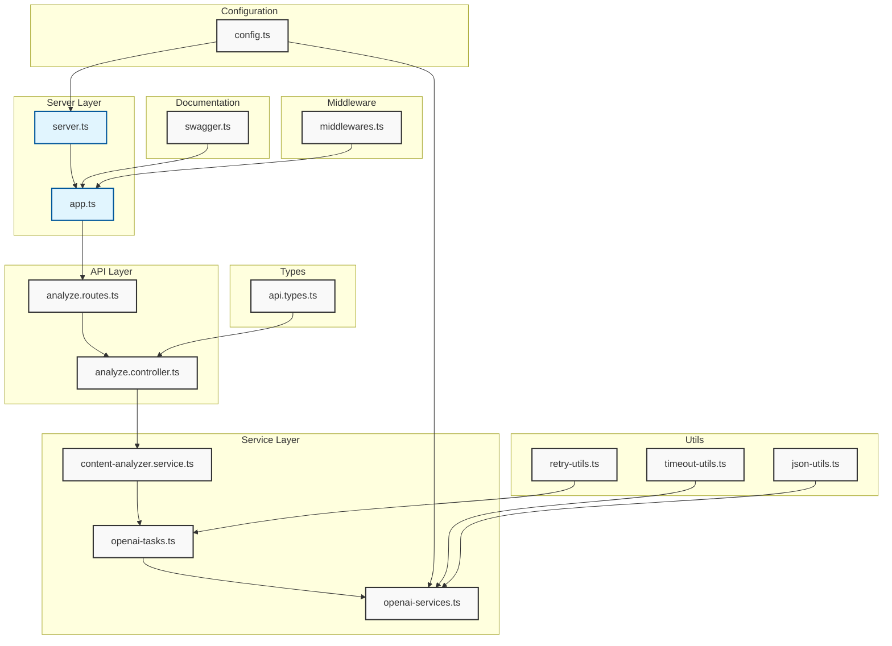
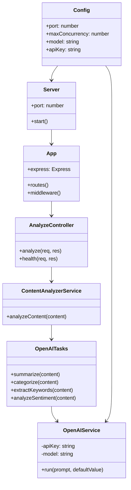

# express-typescript-eslint-prettier-template

An Express.js template with TypeScript, ESLint and Prettier, built for Node.js 22.

Read the full tutorial here: https://medium.com/@gabrieldrouin/node-js-2025-guide-how-to-setup-express-js-with-typescript-eslint-and-prettier-b342cd21c30d

# Content Analysis API

## Project Architecture

### Service Architecture

### Class Diagram

