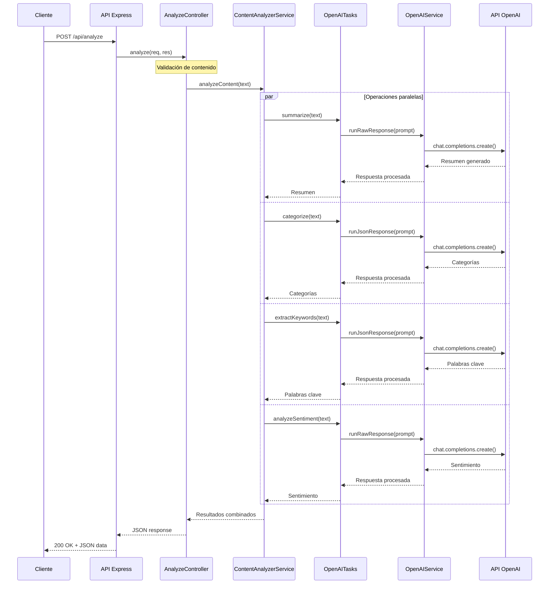
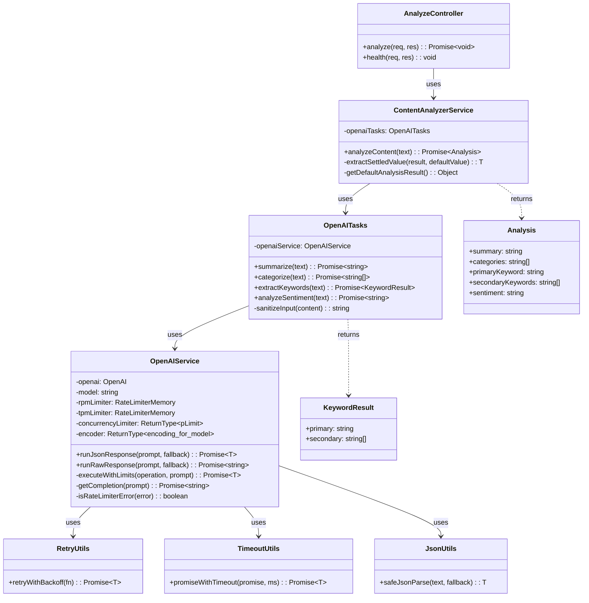
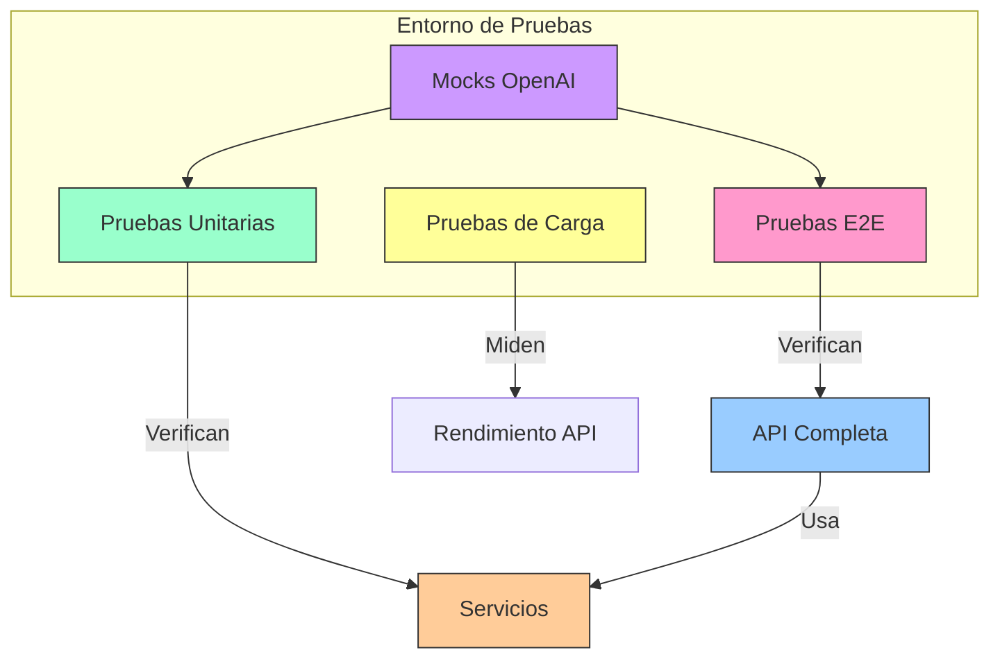
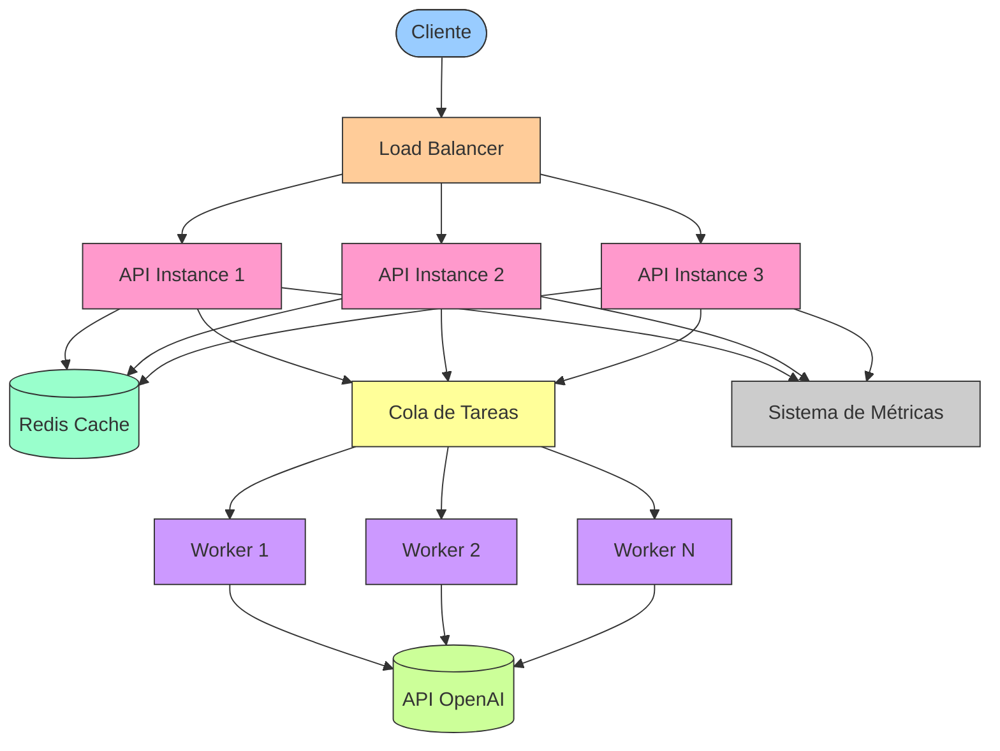

# GrowthX API de Análisis de Textos con LLMs

Esta API utiliza modelos de lenguaje (LLMs) para analizar textos, realizando cuatro operaciones clave: resumen, categorización, extracción de palabras clave y análisis de sentimiento.

## Tabla de Contenidos
- [Enfoque y Decisiones de Diseño](#enfoque-y-decisiones-de-diseño)
- [Características](#características)
- [Requisitos](#requisitos)
- [Instalación](#instalación)
- [Uso](#uso)
- [Arquitectura](#arquitectura)
- [Gestión de la Naturaleza No Determinista de los LLMs](#gestión-de-la-naturaleza-no-determinista-de-los-llms)
- [Pruebas](#pruebas)
- [Escalabilidad y Mejoras Futuras](#escalabilidad-y-mejoras-futuras)

## Enfoque y Decisiones de Diseño

Al enfrentar este desafío técnico, tomé decisiones específicas para crear una API robusta y escalable:

1. **División en tareas discretas**: Separé cada operación de análisis (resumen, categorización, etc.) en tareas independientes con prompts específicos para mejorar la precisión y gestionar la complejidad. Esto facilita el mantenimiento y permite la ejecución en paralelo.

2. **Gestión de límites específicos**: Implementé validación explícita para asegurar que:
   - La categorización siempre devuelve un máximo de 5 categorías
   - La palabra clave primaria es una cadena única
   - Las palabras clave secundarias son un array de cadenas
   - El análisis de sentimiento devuelve específicamente "positive", "negative" o "neutral"

3. **Arquitectura en capas**: Elegí una arquitectura que separa claramente las responsabilidades:
   - Controladores: Manejan las solicitudes HTTP
   - Servicios: Contienen la lógica de negocio
   - Utilidades: Proporcionan funciones auxiliares

4. **Procesamiento asíncrono paralelo**: Utilizo `Promise.all` para ejecutar las cuatro operaciones de análisis en paralelo, reduciendo el tiempo de respuesta total.

5. **Manejo de errores robusto**: Implementé una estrategia de "fail gracefully" que proporciona resultados parciales cuando es posible, en lugar de fallar completamente cuando una subtarea falla.

Estas decisiones me permitieron construir una API que no solo cumple con los requisitos funcionales, sino que también es resistente a errores, eficiente en el uso de recursos y fácil de mantener y extender.

## Características

- **Resumen de contenido**: Genera resúmenes concisos de textos largos
- **Categorización**: Identifica hasta cinco categorías principales del contenido
- **Extracción de palabras clave**: Determina una palabra clave principal y palabras clave secundarias
- **Análisis de sentimiento**: Clasifica el tono general como positivo, negativo o neutral
- **API RESTful**: Interfaz simple para integración con otras aplicaciones
- **Documentación Swagger**: API documentada con interfaz interactiva
- **Manejo de límites de tasa (Rate Limiting)**: Control eficiente de solicitudes a la API de OpenAI
- **Pruebas end-to-end y de carga**: Validación de funcionamiento y rendimiento

## Requisitos

- Node.js v22 o superior
- NPM v10 o superior
- Clave de API de OpenAI

## Instalación

1. Clonar el repositorio:
   ```bash
   git clone https://github.com/tu-usuario/growthx-app.git
   cd growthx-app
   ```

2. Instalar dependencias:
   ```bash
   npm install
   ```

3. Crear archivo de configuración `.env.local`:
   ```
   OPENAI_API_KEY=tu-clave-api-openai
   PORT=3000
   NODE_ENV=development
   ```

4. Iniciar el servidor de desarrollo:
   ```bash
   npm run dev
   ```

La API estará disponible en `http://localhost:3000`. La documentación Swagger se puede acceder en `http://localhost:3000/api-docs`.

## Uso

### Endpoint de Análisis

```
POST /api/analyze
```

**Body:**
```json
{
  "title": "Título del documento (opcional)",
  "content": "Contenido del texto a analizar"
}
```

**Respuesta:**
```json
{
  "status": "success",
  "data": {
    "summary": "Resumen conciso del contenido...",
    "categories": ["Educación", "Tecnología", "Inteligencia Artificial"],
    "primaryKeyword": "aprendizaje automático",
    "secondaryKeywords": ["algoritmos", "redes neuronales", "datos"],
    "sentiment": "positive"
  }
}
```

### Endpoint de Salud

```
GET /api/health
```

**Respuesta:**
```json
{
  "status": "ok",
  "model": "gpt-3.5-turbo",
  "timestamp": "2025-05-08T22:24:42Z"
}
```

## Arquitectura

La aplicación sigue un patrón de arquitectura en capas que facilita el mantenimiento y la escalabilidad. A continuación se muestra el diagrama de la arquitectura general:


### Diagrama de Secuencia

El siguiente diagrama ilustra el flujo de procesamiento de una solicitud de análisis de texto:



### Diagrama de Componentes

Este diagrama muestra la organización de los principales componentes y sus relaciones:



### Componentes principales:

1. **Express.js**: Framework web para la gestión de rutas y middlewares
2. **Controllers**: Manejan las solicitudes HTTP y delegan el procesamiento a los servicios
3. **Services**: Contienen la lógica de negocio y orquestan operaciones complejas
   - **ContentAnalyzerService**: Coordina las operaciones de análisis de texto
   - **OpenAIService**: Encapsula la interacción con la API de OpenAI
4. **Types**: Definiciones de tipos TypeScript para garantizar la seguridad de tipos
5. **Utils**: Utilidades como gestión de reintentos, timeouts y transformación de datos

Esta arquitectura permite un acoplamiento bajo entre componentes y facilita la sustitución de implementaciones (por ejemplo, cambiar de OpenAI a otro proveedor de LLM).

## Gestión de la Naturaleza No Determinista de los LLMs

Los modelos de lenguaje grande (LLMs) son inherentemente no deterministas, lo que presenta desafíos únicos para crear APIs confiables. He implementado varias estrategias para mitigar esta imprevisibilidad:

### 1. Técnicas de prompting avanzadas

Utilizo "Prompt Decorators", una técnica avanzada que mejora significativamente la consistencia de las respuestas. A continuación se muestran ejemplos reales de los prompts utilizados en cada tarea de análisis:

```typescript
// Análisis de sentimiento
const sentimentPrompt = `
  +++OutputFormat(format=single-word, allowed=["positive", "negative", "neutral"])
  +++Constraint(type=response-length, max=1)
  +++ErrorHandling(strategy=graceful-fallback, default="neutral")
  +++SecurityBoundary(enforce=strict)
  Classify the sentiment of this text as positive, negative, or neutral.
  Respond with a single word only, no explanations.

  TEXT TO ANALYZE:
  ${sanitizedContent}
`;

// Categorización
const categorizePrompt = `
  +++OutputFormat(format=json, schema=array)
  +++Constraint(type=array-length, min=1, max=5)
  +++ItemConstraint(type=format, format=lowercase)
  +++RobustParsing(recovery=true)
  +++SecurityBoundary(enforce=strict)
  Identify 1-5 relevant categories for this text.
  Return only a JSON array of lowercase category strings.
  Format: ["category1", "category2", ...]
  No explanations or additional text.

  TEXT TO CATEGORIZE:
  ${sanitizedContent}
`;

// Extracción de palabras clave
const keywordsPrompt = `
  +++OutputFormat(format=json, schema=object)
  +++Schema(type=object, properties={
    primary: {type: string, description: "Main topic keyword"},
    secondary: {type: array, items: {type: string}, minItems: 1, maxItems: 5}
  })
  +++ErrorHandling(strategy=graceful-fallback)
  +++SecurityBoundary(enforce=strict)
  Extract one primary keyword (main topic) and 1-5 secondary keywords from this text.
  Return only this JSON format:
  {
    "primary": "main keyword",
    "secondary": ["keyword1", "keyword2", ...]
  }

  TEXT TO ANALYZE:
  ${sanitizedContent}
`;

// Resumen
const summarizePrompt = `
  +++Concise(level=high)
  +++TL;DR(style=informative)
  +++Constraint(type=focus, value=essential-information)
  +++OutputFormat(format=plain-text)
  +++SecurityBoundary(enforce=strict)
  Create a concise summary capturing the main points of this text.
  Keep it brief, coherent, and focused on essential information.

  TEXT TO SUMMARIZE:
  ${sanitizedContent}
`;
```

Estos decoradores proporcionan instrucciones explícitas que generan respuestas más predecibles y estructuradas. Las ventajas de este enfoque incluyen:

- **Control preciso del formato**: Decoradores como `+++OutputFormat` especifican exactamente el formato esperado
- **Validación integrada**: Restricciones como `+++Constraint` garantizan que se cumplan los límites requeridos
- **Manejo de errores robusto**: Decoradores como `+++ErrorHandling` definen estrategias para casos excepcionales
- **Seguridad mejorada**: `+++SecurityBoundary` proporciona protección contra ataques de inyección de prompt
- **Estructura semántica**: Decoradores como `+++Concise` y `+++TL;DR` orientan el estilo y tono de la respuesta

Además, implementamos un proceso de sanitización para prevenir ataques de inyección de prompt:

```typescript
private sanitizeInput(content: string): string {
  // Eliminar decoradores que podrían intentar inyectarse
  let sanitized = content.replace(/\+\+\+\w+(\(.*?\))?/g, '[FILTERED]');

  // Filtrar patrones comunes de ataques de inyección
  const injectionPatterns = [
    /ignore (previous|above|all) instructions/gi,
    /disregard (previous|above|all) instructions/gi,
    /forget (previous|above|all) instructions/gi,
    /new instructions/gi,
    /instead (do|perform|follow)/gi,
  ];

  for (const pattern of injectionPatterns) {
    sanitized = sanitized.replace(pattern, '[FILTERED]');
  }

  return sanitized;
}
```

### 2. Validación y post-procesamiento

Para garantizar que las respuestas cumplan con los requisitos específicos:

```typescript
// Validación para categorías
const validateCategories = (categories: unknown): string[] => {
  if (!Array.isArray(categories)) return ['Uncategorized'];
  
  // Garantizar que solo tenemos strings
  const validCategories = categories
    .filter(category => typeof category === 'string')
    .map(category => category.trim());
    
  // Limitar a máximo 5 categorías
  return validCategories.slice(0, 5);
};
```

### 3. Manejo de errores y resultados fallidos

Implementé una estrategia que proporciona valores predeterminados significativos cuando una operación falla:

```typescript
// En ContentAnalyzerService
const tasks = {
  categories: this.openaiTasks.categorize(content).catch(() => ['uncategorized']),
  keywords: this.openaiTasks.extractKeywords(content).catch(() => ({ primary: '', secondary: [] })),
  sentiment: this.openaiTasks.analyzeSentiment(content).catch(() => 'neutral'),
  summary: this.openaiTasks.summarize(content).catch(() => ''),
};

// Usar Promise.allSettled para obtener resultados incluso si algunas tareas fallan
const results = await Promise.allSettled([tasks.categories, tasks.summary, tasks.keywords, tasks.sentiment]);
```

Esta combinación de técnicas de prompting avanzadas, validación rigurosa y manejo elegante de errores permite que la API genere resultados consistentes y predecibles a pesar de la naturaleza no determinista de los LLMs.

## Pruebas

### Pruebas End-to-End

Las pruebas e2e verifican el funcionamiento completo de la API:

```bash
npm run test:run
```

### Diagrama de arquitectura de pruebas



### Pruebas de Carga

Implementamos pruebas de carga utilizando `autocannon` para medir el rendimiento bajo diferentes niveles de carga:

```bash
# Prueba con carga ligera (5 conexiones concurrentes)
npm run load-test:light

# Prueba con carga media (25 conexiones concurrentes)
npm run load-test:medium

# Prueba con carga alta (50 conexiones concurrentes)
npm run load-test:heavy
```

Ejemplo de resultados de prueba de carga:

| Métrica                   | Valor |
| ------------------------- | ----- |
| Solicitudes/seg promedio  | 1059  |
| Latencia promedio (ms)    | 4.19  |
| Latencia máxima (ms)      | 796   |
| Solicitudes totales       | 10590 |
| Respuestas exitosas (2xx) | 10590 |
| Respuestas con error      | 0     |

Estos resultados muestran que la API puede manejar un volumen significativo de solicitudes con tiempos de respuesta bajos, incluso con las limitaciones de tasa de la API de OpenAI.

## Escalabilidad y Mejoras Futuras

El diseño actual se puede expandir en varias direcciones:

### 1. Caché para resultados frecuentes

Implementación de una capa de caché utilizando Redis para almacenar resultados de análisis frecuentes, reduciendo llamadas a la API de OpenAI.

### 2. Procesamiento por lotes para documentos grandes

Un desafío importante cuando se trabaja con LLMs es el manejo de textos extensos que exceden los límites de contexto del modelo (4K-8K tokens para modelos como GPT-3.5 Turbo). Para abordar este problema, implementamos una técnica de fragmentación (chunking) que permite procesar documentos de cualquier longitud:

```typescript
function splitIntoChunks(text: string, chunkSize: number = 4000): string[] {
  const paragraphs = text.split('\n\n');
  const chunks: string[] = [];
  let currentChunk = '';

  for (const paragraph of paragraphs) {
    if (currentChunk.length + paragraph.length > chunkSize) {
      chunks.push(currentChunk.trim());
      currentChunk = '';
    }
    currentChunk += paragraph + '\n\n';
  }

  if (currentChunk.trim()) {
    chunks.push(currentChunk.trim());
  }

  return chunks;
}
```

Esta técnica divide el texto en fragmentos más pequeños respetando los límites naturales de párrafos, lo que preserva el contexto local. Luego aplicamos estrategias específicas para cada tipo de análisis:

#### Aplicación a las tareas de análisis

**1. Resumen de textos extensos:**
```typescript
async summarizeLargeContent(content: string): Promise<string> {
  if (content.length < 4000) {
    return this.openaiTasks.summarize(content);
  }
  
  // 1. Dividir en fragmentos
  const chunks = splitIntoChunks(content, 3800);
  
  // 2. Resumir cada fragmento paralelamente
  const chunkSummaries = await Promise.all(
    chunks.map(chunk => this.openaiTasks.summarize(chunk))
  );
  
  // 3. Si los resúmenes combinados siguen siendo extensos, generar un meta-resumen
  const combinedSummary = chunkSummaries.join('\n\n');
  
  if (combinedSummary.length > 4000) {
    return this.openaiTasks.summarize(combinedSummary);
  }
  
  return combinedSummary;
}
```

**2. Categorización de contenido extenso:**
```typescript
async categorizeLargeContent(content: string): Promise<string[]> {
  if (content.length < 4000) {
    return this.openaiTasks.categorize(content);
  }
  
  // 1. Dividir en fragmentos
  const chunks = splitIntoChunks(content, 3800);
  
  // 2. Categorizar cada fragmento
  const allCategories: string[][] = await Promise.all(
    chunks.map(chunk => this.openaiTasks.categorize(chunk))
  );
  
  // 3. Contar frecuencia de cada categoría
  const categoryFrequency = new Map<string, number>();
  
  allCategories.flat().forEach(category => {
    const normalizedCategory = category.toLowerCase();
    categoryFrequency.set(
      normalizedCategory, 
      (categoryFrequency.get(normalizedCategory) || 0) + 1
    );
  });
  
  // 4. Seleccionar las 5 categorías más frecuentes
  return Array.from(categoryFrequency.entries())
    .sort((a, b) => b[1] - a[1])
    .slice(0, 5)
    .map(([category]) => category);
}
```

**3. Extracción de palabras clave:**
```typescript
async extractKeywordsFromLargeContent(content: string): Promise<{primary: string, secondary: string[]}> {
  if (content.length < 4000) {
    return this.openaiTasks.extractKeywords(content);
  }
  
  // 1. Dividir en fragmentos
  const chunks = splitIntoChunks(content, 3800);
  
  // 2. Extraer palabras clave de cada fragmento
  const allKeywords = await Promise.all(
    chunks.map(chunk => this.openaiTasks.extractKeywords(chunk))
  );
  
  // 3. Contar frecuencia de palabras clave
  const keywordFrequency = new Map<string, number>();
  
  // Añadir palabras clave primarias con peso 3
  allKeywords.forEach(result => {
    const normalizedKeyword = result.primary.toLowerCase();
    keywordFrequency.set(
      normalizedKeyword,
      (keywordFrequency.get(normalizedKeyword) || 0) + 3
    );
  });
  
  // Añadir palabras clave secundarias con peso 1
  allKeywords.forEach(result => {
    result.secondary.forEach(keyword => {
      const normalizedKeyword = keyword.toLowerCase();
      keywordFrequency.set(
        normalizedKeyword,
        (keywordFrequency.get(normalizedKeyword) || 0) + 1
      );
    });
  });
  
  // 4. Determinar la palabra clave primaria y las secundarias
  const sortedKeywords = Array.from(keywordFrequency.entries())
    .sort((a, b) => b[1] - a[1]);
  
  return {
    primary: sortedKeywords[0][0],
    secondary: sortedKeywords.slice(1, 11).map(([keyword]) => keyword)
  };
}
```

**4. Análisis de sentimiento:**
```typescript
async analyzeSentimentOfLargeContent(content: string): Promise<string> {
  if (content.length < 4000) {
    return this.openaiTasks.analyzeSentiment(content);
  }
  
  // 1. Dividir en fragmentos
  const chunks = splitIntoChunks(content, 3800);
  
  // 2. Analizar sentimiento de cada fragmento
  const sentiments = await Promise.all(
    chunks.map(chunk => this.openaiTasks.analyzeSentiment(chunk))
  );
  
  // 3. Contar frecuencia de cada sentimiento
  const sentimentCounts = {
    'positive': 0,
    'negative': 0,
    'neutral': 0
  };
  
  sentiments.forEach(sentiment => {
    sentimentCounts[sentiment]++;
  });
  
  // 4. Determinar el sentimiento predominante
  if (sentimentCounts.positive > sentimentCounts.negative) {
    return sentimentCounts.positive > sentimentCounts.neutral ? 'positive' : 'neutral';
  } else if (sentimentCounts.negative > sentimentCounts.positive) {
    return sentimentCounts.negative > sentimentCounts.neutral ? 'negative' : 'neutral';
  } else {
    return 'neutral';
  }
}
```

#### Ventajas del procesamiento por lotes

Este enfoque brinda varias ventajas importantes:

1. **Escalabilidad**: Permite procesar documentos de cualquier tamaño, superando la limitación de contexto de los LLMs.
2. **Preservación del contexto**: Al respetar límites de párrafos, mantenemos la coherencia dentro de cada fragmento.
3. **Procesamiento paralelo**: Las tareas se ejecutan concurrentemente, reduciendo el tiempo total de procesamiento.
4. **Agregación inteligente**: Cada tipo de análisis utiliza un método de combinación adecuado a su naturaleza (meta-resumen para resúmenes, frecuencia para categorías, etc.).
5. **Eficiencia de costos**: Optimiza el uso de tokens al enviar solo el contenido necesario para cada tarea.

#### Implementación en producción

En un entorno de producción, estas técnicas se integrarían con sistemas asíncronos de procesamiento y notificación para manejar tiempos de respuesta prolongados en documentos muy extensos. Por ejemplo:

```typescript
// Pseudocódigo
async function handleLargeDocumentAnalysis(content: string): Promise<string> {
  // Si el contenido es grande, procesarlo en segundo plano
  if (content.length > 10000) {
    const jobId = await queueService.enqueueJob({
      type: 'document-analysis',
      content,
      timestamp: new Date()
    });
    
    return jobId; // Devolver un ID que el cliente puede usar para consultar el estado
  }
  
  // Procesar documentos pequeños inmediatamente
  return await contentAnalyzerService.analyzeContent(content);
}
```

Esta arquitectura permite que la API siga siendo responsiva incluso cuando procesa documentos muy grandes.

### Arquitectura de escalabilidad futura



### 3. Observabilidad mejorada

Integración con sistemas de monitoreo y alertas para rastrear el rendimiento y la disponibilidad de la API.

### 4. Arquitectura distribuida

Evolución hacia una arquitectura de microservicios donde cada operación de análisis (resumen, categorización, etc.)
podría ejecutarse en servicios separados, permitiendo escalado independiente.

### 5. Soporte para más fuentes de documentos

Ampliación para procesar diferentes formatos (PDF, Markdown, HTML) mediante una capa de preprocesamiento.

---

## Contribuciones

Este proyecto fue desarrollado como una prueba técnica para GrowthX. Para contribuir, por favor:

1. Haga fork del repositorio
2. Cree una rama para su característica (`git checkout -b feature/amazing-feature`)
3. Haga commit de sus cambios (`git commit -m 'Add some amazing feature'`)
4. Push a la rama (`git push origin feature/amazing-feature`)
5. Abra un Pull Request