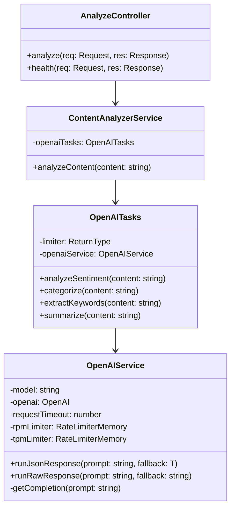
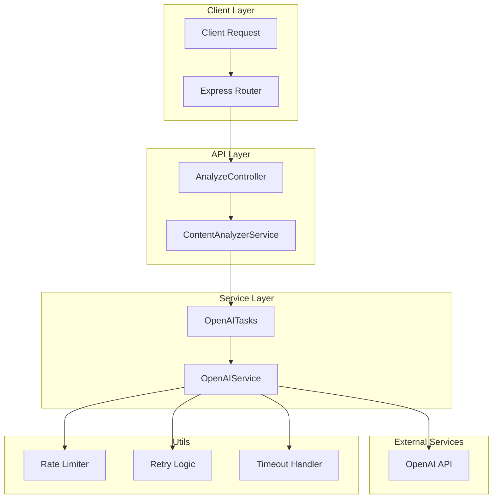
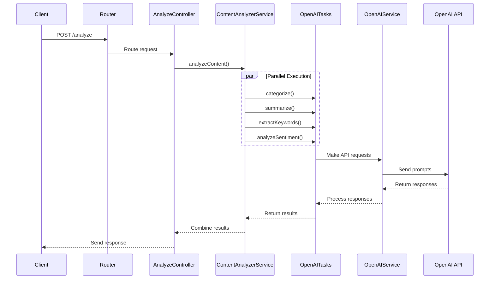
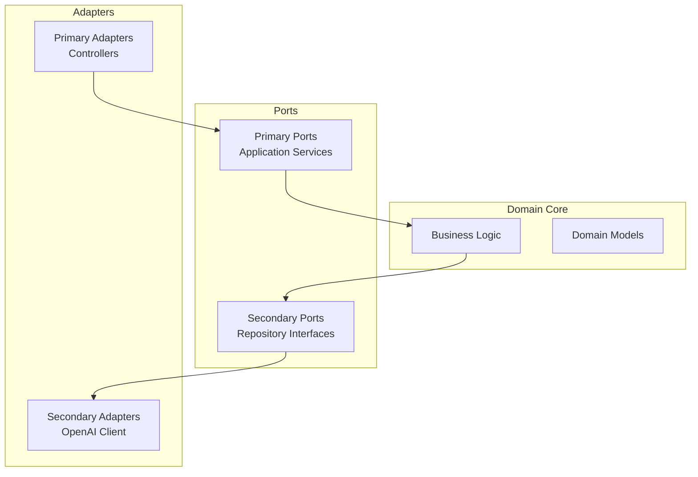

# Content Analysis API

A sophisticated text analysis API using OpenAI's GPT models to provide content summarization, sentiment analysis, keyword extraction, and categorization.

## Getting Started

### Prerequisites

- Node.js 22 or higher
- npm 10 or higher
- An OpenAI API key

### Installation

1. Clone the repository:

```bash
git clone https://github.com/yourusername/growthx-app.git
cd growthx-app
```

2. Install dependencies:

```bash
npm install
```

3. Create your environment file:

```bash
cp .env.example .env.local
```

4. Configure your environment variables in `.env.local`:

```env
# Required
OPENAI_API_KEY=your_api_key_here

# Optional (defaults shown)
PORT=3000
NODE_ENV=development
OPENAI_MODEL=o3-mini
MAX_CONCURRENCY=8
MAX_RPM=100
MAX_TPM=10000
REQUEST_TIMEOUT=30000
```

### Available Scripts

- `npm run dev`: Start the development server with hot reload
- `npm run build`: Build the project for production
- `npm start`: Run the production build
- `npm run type-check`: Check TypeScript types
- `npm run lint`: Run ESLint
- `npm run lint:fix`: Fix ESLint issues automatically
- `npm run format`: Format code with Prettier
- `npm run format:check`: Check code formatting
- `npm test`: Run tests in watch mode
- `npm run test:run`: Run tests once
- `npm run test:ui`: Run tests with UI
- `npm run coverage`: Generate test coverage report

### Setting up Git Hooks

The project uses Husky for Git hooks to ensure code quality. To set up:

1. Install husky (already done by npm install)

```bash
npm install
```

2. Initialize husky:

```bash
npm run prepare
```

3. The pre-commit hook will automatically run:
   - Type checking
   - Linting
   - Unit tests
   - Code formatting

### Development Workflow

1. Create a new branch for your feature:

```bash
git checkout -b feature/your-feature-name
```

2. Make your changes and commit them:

```bash
git add .
git commit -m "feat: your feature description"
```

The pre-commit hook will automatically run checks before the commit is created.

3. Push your changes:

```bash
git push origin feature/your-feature-name
```

### API Documentation

Once the server is running, you can access the API documentation at:

```
http://localhost:3000/api-docs
```

## Architecture

### Current Architecture Overview

The project follows a modified MVC (Model-View-Controller) pattern adapted for a REST API, with a focus on scalability and maintainability.

### Class Diagram



### Service Architecture



### Request Flow Sequence



### Architecture Decisions

1. **Modified MVC Pattern**

   - **Controllers**: Handle HTTP requests and responses
   - **Services**: Contain business logic and orchestration
   - **Models**: Represented through TypeScript interfaces

2. **Scalability Features**

   - Rate limiting for API calls
   - Concurrent request handling
   - Retry mechanisms with exponential backoff
   - Request timeout handling

3. **Current Benefits**

   - Clear separation of concerns
   - Easy to test components in isolation
   - Simple to add new features or modify existing ones
   - Efficient error handling and retry mechanisms

4. **Path to Hexagonal Architecture**

If needed, the current architecture can be evolved to a hexagonal (ports and adapters) architecture:



This evolution would involve:

- Creating domain models for analysis results
- Defining ports (interfaces) for AI services
- Implementing adapters for different AI providers
- Isolating the business logic in the domain core

### Why This Architecture?

1. **Maintainability**

   - Clear component responsibilities
   - Easy to understand code organization
   - Simplified testing and debugging

2. **Scalability**

   - Easy to add new AI providers
   - Simple to implement caching
   - Ready for horizontal scaling

3. **Reliability**

   - Built-in error handling
   - Rate limiting protection
   - Timeout management

4. **Extensibility**
   - New endpoints can be added easily
   - Support for different AI models
   - Simple integration of additional services
